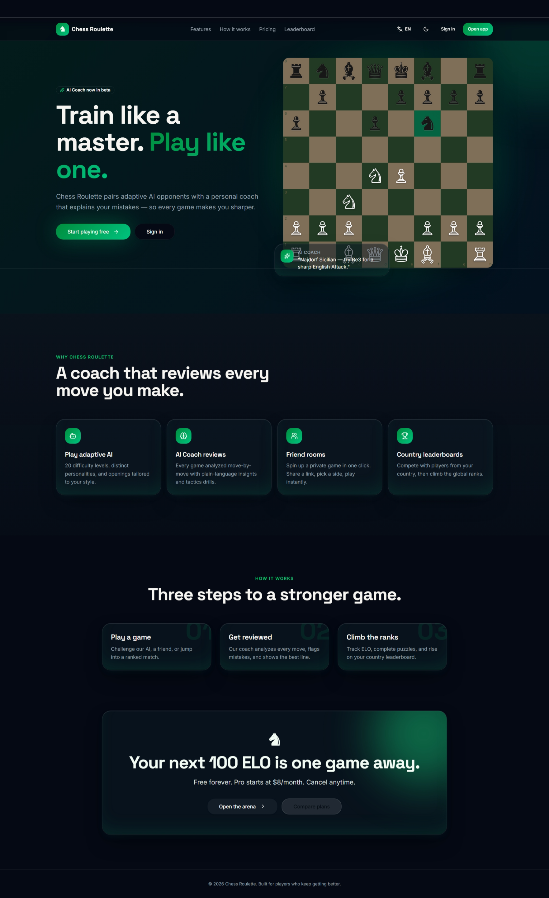
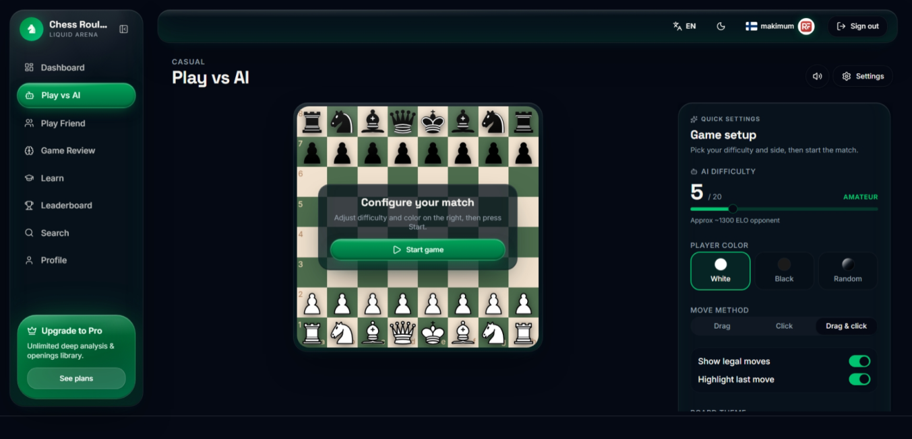
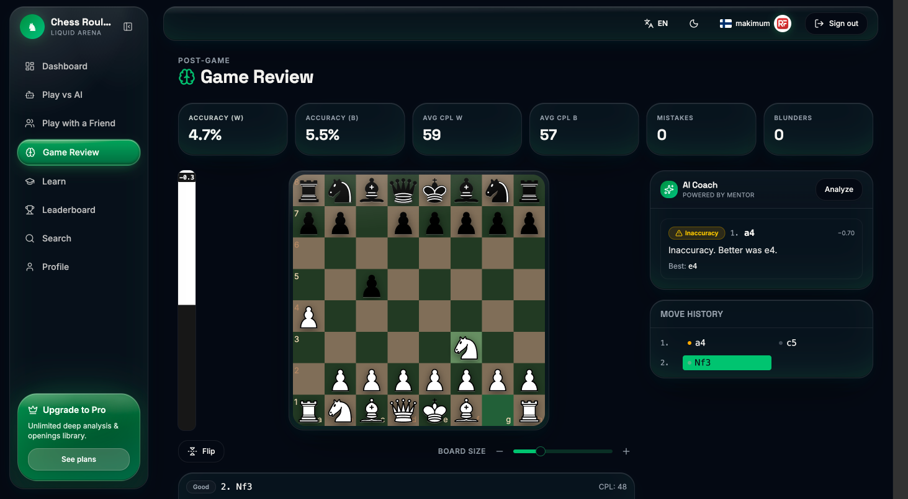
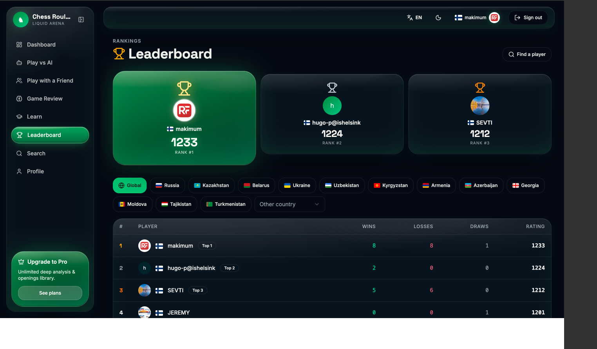

[README.md](https://github.com/user-attachments/files/27177425/document.md)
<div align="center">

# [**♞ Chess Roulette**](https://chess-roulette.lovable.app)

### AI-тренер, игра и анализ партий

Играй с адаптивным AI-соперником, разбирай каждую партию с персональным AI-коучем и поднимайся в городском и страновом лидербордах.

[](https://react.dev)
[](https://tanstack.com/start)
[](https://www.typescriptlang.org/)
[](https://tailwindcss.com)
[](https://vitejs.dev)
[](#-лицензия)

[**🎮 Live Demo**](https://chess-roulette.lovable.app) · [**🐛 Issues**](../../issues) · [**✨ Запросить фичу**](../../issues/new)

</div>

---

## 📑 Оглавление

- [О проекте](#-о-проекте)
- [Возможности](#-возможности)
- [Скриншоты](#-скриншоты)
- [Технологический стек](#-технологический-стек)
- [Быстрый старт](#-быстрый-старт)
- [Переменные окружения](#-переменные-окружения)
- [Структура проекта](#-структура-проекта)
- [Маршруты приложения](#-маршруты-приложения)
- [Скрипты](#-скрипты)
- [Деплой](#-деплой)
- [Дорожная карта](#-дорожная-карта)
- [Вклад в проект](#-вклад-в-проект)
- [Лицензия](#-лицензия)
- [Благодарности](#-благодарности)

---

## 🎯 О проекте

**Chess Roulette** — современное веб-приложение для тех, кто учится и играет в шахматы. Оно объединяет:

- **адаптивного AI-соперника**, который подстраивается под ваш уровень,
- **персонального AI-коуча**, объясняющего каждый ход после партии,
- **онлайн-игру с друзьями** по приглашению со встроенной видеосвязью,
- **обучение** через интерактивные уроки на доске,
- **лидерборды** по городу и стране для здоровой конкуренции.

Проект построен на современном стеке: TanStack Start, React 19, Tailwind v4 и развёртывается на Cloudflare Workers.

---

## ✨ Возможности

|  | Фича | Описание |
|:-:|:--|:--|
| 🤖 | **AI-соперник** | Игра против AI с настраиваемой сложностью и стилем |
| 🧠 | **AI-коуч** | Пост-разбор партии: ошибки, лучшие ходы, рекомендации |
| 👥 | **Игра с друзьями** | Приватные комнаты по invite-ссылке |
| 📹 | **Видеозвонок** | Встроенный голос и видео в живых партиях (Agora RTC) |
| 📚 | **Обучение** | Уроки с пошаговой интерактивной доской |
| 🏆 | **Лидерборды** | Рейтинги по городу и стране |
| 👤 | **Профили и поиск** | Карточки игроков, история партий, поиск по никнейму |
| 🌍 | **Мультиязычность** | Английский и русский (i18next) |
| 🌗 | **Тёмная и светлая тема** | Системная тема + ручное переключение |
| 📱 | **Адаптив** | Мобильная и десктопная вёрстка |

---

## 📸 Скриншоты


<div align="center">

| Главная | Игра против AI |
|:-:|:-:|
|  |  |

| Разбор партии | Лидерборд |
|:-:|:-:|
|  |  |

</div>

---

## 🛠 Технологический стек

| Слой | Технология |
|:--|:--|
| **Фреймворк** | [TanStack Start v1](https://tanstack.com/start) + [React 19](https://react.dev) |
| **Сборка** | [Vite 7](https://vitejs.dev) + [Cloudflare Vite Plugin](https://developers.cloudflare.com/workers/vite-plugin/) |
| **Язык** | [TypeScript 5.8](https://www.typescriptlang.org/) (strict) |
| **Стили** | [Tailwind CSS v4](https://tailwindcss.com) + `tw-animate-css` |
| **UI-компоненты** | [shadcn/ui](https://ui.shadcn.com) на [Radix UI](https://www.radix-ui.com), [lucide-react](https://lucide.dev), [sonner](https://sonner.emilkowal.ski) |
| **Шахматы** | [chess.js](https://github.com/jhlywa/chess.js) + [react-chessboard](https://github.com/Clariity/react-chessboard) |
| **Данные / формы** | [TanStack Query](https://tanstack.com/query), [React Hook Form](https://react-hook-form.com) + [Zod](https://zod.dev) |
| **i18n** | [i18next](https://www.i18next.com) + `react-i18next` |
| **Видео** | [Agora RTC SDK](https://www.agora.io) |
| **Графики** | [Recharts](https://recharts.org) |
| **Деплой** | [Cloudflare Workers](https://workers.cloudflare.com) (Wrangler) |

---

## 🚀 Быстрый старт

### Требования

- **[Bun](https://bun.sh)** ≥ 1.0 *(рекомендуется)* или **Node.js** ≥ 20
- Git

### Установка

```bash
# 1. Клонировать репозиторий
git clone https://github.com/your-username/chess-roulette.git
cd chess-roulette

# 2. Установить зависимости
bun install

# 3. Настроить .env (см. раздел ниже)
cp .env.example .env

# 4. Запустить dev-сервер
bun run dev
```

Откройте [http://localhost:5173](http://localhost:5173) в браузере.

---

## 🔐 Переменные окружения

Создайте файл `.env` в корне проекта:

```env
# Backend API
VITE_API_BASE_URL=https://api.chess-roulette.example.com
VITE_WS_BASE_URL=wss://api.chess-roulette.example.com

# Agora (видеозвонки)
VITE_AGORA_APP_ID=your-agora-app-id
```

> 💡 Никогда не коммитьте реальные ключи. Используйте `.env.local` для локальных секретов.

---

## 📁 Структура проекта

```text
chess-roulette/
├── src/
│   ├── routes/                  # File-based роутинг TanStack Start
│   │   ├── __root.tsx           # Корневой layout (html/head/body)
│   │   ├── index.tsx            # Главная страница (/)
│   │   ├── auth.tsx             # Авторизация
│   │   ├── dashboard.tsx        # Личный кабинет
│   │   ├── play.ai.tsx          # Игра против AI
│   │   ├── play.friend.tsx      # Игра с другом
│   │   ├── review.tsx           # Разбор партии с AI-коучем
│   │   ├── learn.tsx            # Обучение
│   │   ├── leaderboard.tsx      # Лидерборды
│   │   ├── players.search.tsx   # Поиск игроков
│   │   ├── profile.$userId.tsx  # Чужой профиль
│   │   ├── profile.tsx          # Свой профиль
│   │   └── pricing.tsx          # Тарифы
│   ├── components/
│   │   ├── chess/               # Доска, часы, история ходов, AI-панели
│   │   ├── learning/            # Уроки и обучающие компоненты
│   │   ├── auth/                # Модалки auth/email/password
│   │   └── ui/                  # shadcn/ui примитивы
│   ├── hooks/                   # use-chess-game, use-sound-settings, ...
│   ├── i18n/                    # locales/en.ts, locales/ru.ts
│   ├── lib/                     # api.ts, auth.ts, live-game-socket.ts
│   ├── router.tsx
│   └── styles.css               # Tailwind v4 + дизайн-токены (oklch)
├── public/
├── wrangler.jsonc               # Конфиг Cloudflare Worker
├── vite.config.ts
└── package.json
```

---

## 🗺 Маршруты приложения

| URL | Назначение |
|:--|:--|
| `/` | Лендинг |
| `/auth` | Вход / регистрация |
| `/dashboard` | Личный кабинет с прогрессом |
| `/play/ai` | Игра против AI |
| `/play/friend` | Игра с другом по invite-ссылке |
| `/review` | Разбор партии с AI-коучем |
| `/learn` | Уроки и обучение |
| `/leaderboard` | Рейтинги: город / страна |
| `/players/search` | Поиск игроков |
| `/profile/:userId` | Профиль игрока |
| `/profile` | Свой профиль |
| `/pricing` | Тарифы |

---

## 📜 Скрипты

| Команда | Описание |
|:--|:--|
| `bun run dev` | Запуск dev-сервера на `localhost:5173` |
| `bun run build` | Production-сборка |
| `bun run build:dev` | Dev-сборка |
| `bun run preview` | Локальный предпросмотр продакшен-сборки |
| `bun run lint` | ESLint по проекту |
| `bun run format` | Форматирование Prettier |

---

## ☁️ Деплой

Проект развёртывается на **Cloudflare Workers** через Wrangler.

```bash
# Сборка
bun run build

# Деплой
bunx wrangler deploy
```

Альтернативно — одной кнопкой через **[Lovable](https://lovable.dev)** (Publish).

**Production:** [chess-roulette.lovable.app](https://chess-roulette.lovable.app)

---

## 🛣 Дорожная карта

- [x] AI-соперник и AI-коуч
- [x] Игра с друзьями + видеозвонок
- [x] Лидерборды (город / страна)
- [x] Мультиязычность (EN / RU)
- [ ] 💳 Stripe-оплата плана **Pro** *(coming soon)*
- [ ] 🏟 Турниры и матчи на вылет
- [ ] 📖 Дебютная база с обучающими маршрутами
- [ ] 📱 Мобильное приложение (React Native)
- [ ] 🤝 Командные клубы и школы

---

## 🤝 Вклад в проект

PR и issues приветствуются! Стандартный flow:

1. **Fork** репозитория
2. Создайте ветку: `git checkout -b feature/amazing-feature`
3. Закоммитьте изменения: `git commit -m "feat: add amazing feature"`
4. Запушьте ветку: `git push origin feature/amazing-feature`
5. Откройте **Pull Request**

Перед PR убедитесь, что проходят `bun run lint` и `bun run build`.

---

## 📄 Лицензия

Проект распространяется под лицензией **MIT**. Подробнее — в файле [`LICENSE`](LICENSE).

```
MIT License

Copyright (c) 2026 Chess Roulette

Permission is hereby granted, free of charge, to any person obtaining a copy
of this software and associated documentation files (the "Software"), to deal
in the Software without restriction, including without limitation the rights
to use, copy, modify, merge, publish, distribute, sublicense, and/or sell
copies of the Software, and to permit persons to whom the Software is
furnished to do so, subject to the following conditions:

The above copyright notice and this permission notice shall be included in all
copies or substantial portions of the Software.

THE SOFTWARE IS PROVIDED "AS IS", WITHOUT WARRANTY OF ANY KIND.
```

---

## 🙏 Благодарности

- [chess.js](https://github.com/jhlywa/chess.js) — игровая логика
- [react-chessboard](https://github.com/Clariity/react-chessboard) — доска
- [shadcn/ui](https://ui.shadcn.com) — UI-компоненты
- [TanStack](https://tanstack.com) — роутер и data-слой
- [Lovable](https://lovable.dev) — платформа для разработки

---

<div align="center">

Сделано с ♞ и ❤️ командой **Chess Roulette**

⭐ Поставьте звезду, если проект вам нравится!

</div>
